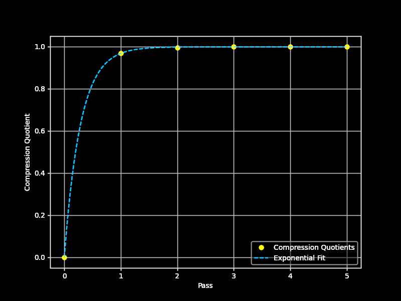
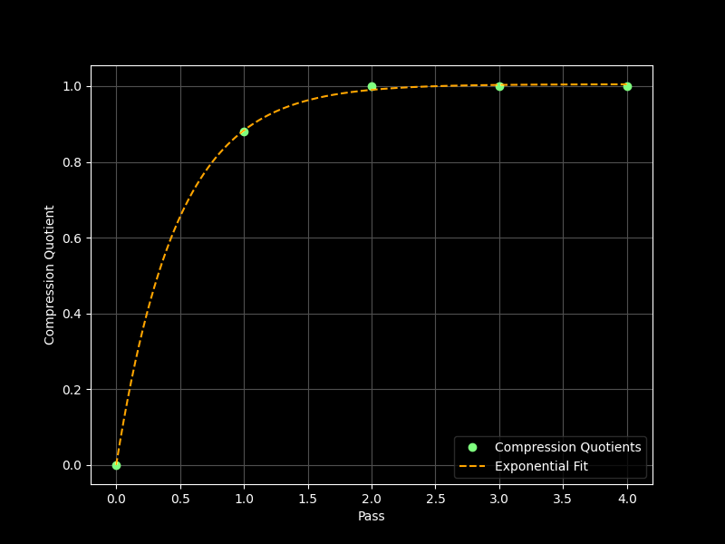

## Performance

### `filterAuthorInlineStyles`

The [`filterAuthorInlineStyles` algorithm][css-author-style-filter] was proven to be a single-pass deterministic compression.

Data was collected from manual testing on the output of the `domtoimage.toSvg` function in the `dom-to-image` NPM package.

### Large file inputs

$O(N)$ growth for inputs at large filesizes $|F| >> 1e6 \text{ bytes}$.

| Wikipedia article demo    | Value                                  |
| :------------------------ | :------------------------------------- |
| Number of nodes           | 5558 nodes                             |
| Initial declaration count | 2107482 (377.54 declarations / node)   |
| Pre-compression bytes     | 33.79mb                                |
| Reductions                | 27901890                               |
| Processing time           | 7921.5ms (1.85 ms/node)                |
| Total reduction           | 27.90mb                                |
| Output declaration count  | 263099 (47.13 / node)                  |
| Post-compression bytes    | 5.89mb                                 |
| Compression ratio         | `5.74                                ` |

### `filterWinningInlineStyles`

The `filterWinningInlineStyles` algorithm was proven to be a high-pass multi-pass - $N \approx 4$ - deterministic compression in two modes.

Data was collected from manual testing on the output of the `domtoimage.toSvg` function in the `dom-to-image-more` NPM package.

### Large file inputs

$O(nlog(N))$ growth for inputs at large filesizes $|F| >> 1e6 \text{ bytes}$.

| Wikipedia article demo    | Value                                  |
| :------------------------ | :------------------------------------- |
| Number of nodes           | 5558 nodes                             |
| Initial declaration count | 186985 (33.65 declarations / node)     |
| Pre-compression bytes     | 3.88mb                                 |
| Reductions                | [2970178, 95584, 16774, 0]             |
| Processing time           | 7921.5ms (1.43 ms/node)                |
| Total reduction           | 3.09mb                                 |
| Output declaration count  | 83512 (15.03 / node)                   |
| Post-compression bytes    | 793.7kb                                |
| Compression quotients     | [0.5379, 0.8891, 0.9800, 1]            |
| Compression ratio         | `4.88                                ` |
| Decay formula             | $1-exp(-33 / 17 \cdot N)$              |

### Graph

### Small file results

$O(nlog(N))$ growth for inputs at small filesizes $|F| << 1e6\space\text{ bytes}$.

| Code screenshot demo      | Value                                  |
| :------------------------ | :------------------------------------- |
| Number of nodes           | 420 nodes                              |
| Initial declaration count | 17551 (41.79 declarations / node)      |
| Pre-compression bytes     | 429160b                                |
| Reductions                | [298806, 40420, 0]                     |
| Processing time           | 5445.2ms (12.96 ms / node)             |
| Total reduction           | 339226b                                |
| Post-compression bytes    | 89934b                                 |
| Output declaration count  | 7637 (18.18 / node)                    |
| Compression quotients     | [0.696, 0.931, 1]                      |
| Total quotient (compound) | `4.77                                ` |
| Decay formula             | $1-exp(-23 / 11 \cdot N)$              |

<!-- `dom-inline-style-filter` -->
[css-author-style-filter]: https://github.com/1904labs/dom-to-image-more/pull/71
